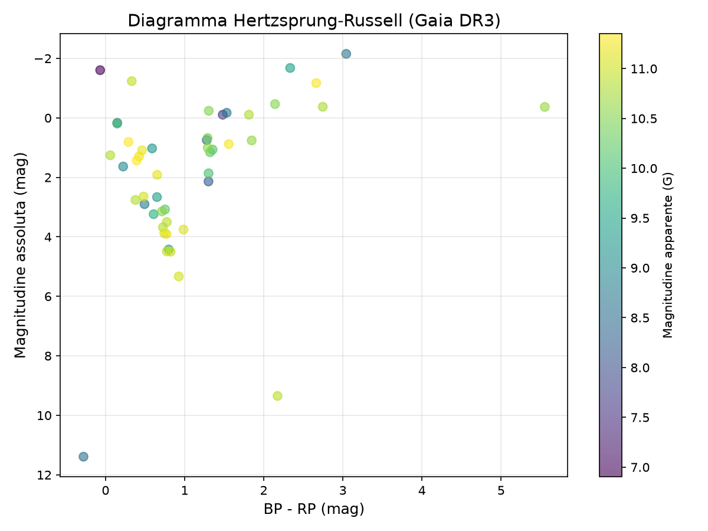
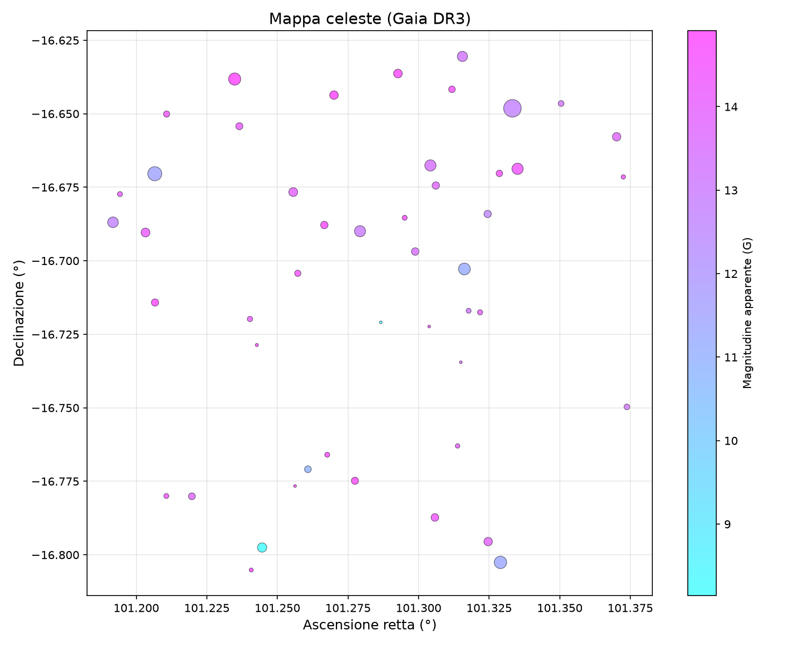
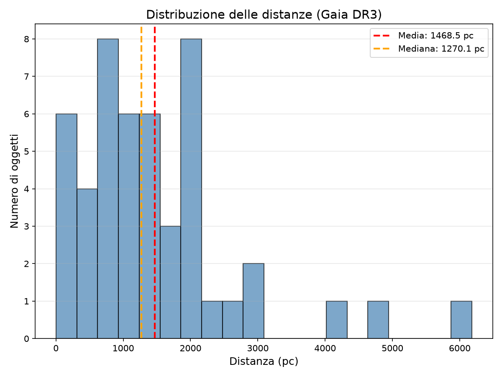
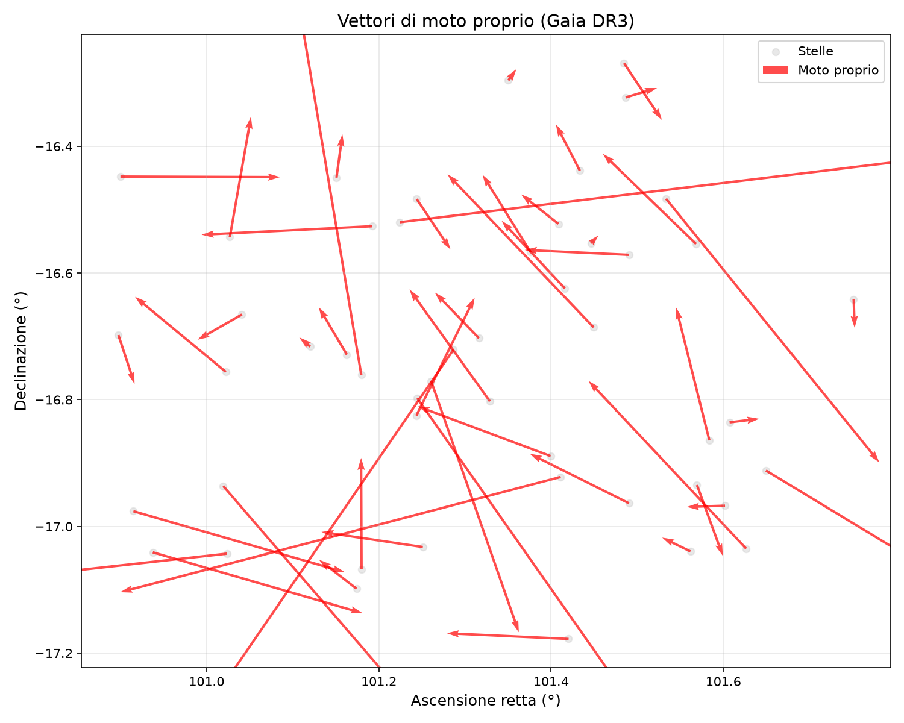

<div align="center">

# 🌌 AstroNew

### Explore the real ESA Gaia DR3 archive from your terminal — with verified astrophysics and an autonomous AI assistant.

[](./LICENZE.md)
[](https://www.python.org/)
[](https://www.cosmos.esa.int/web/gaia/data-release-3)

</div>

---

## 📖 About AstroNew

**AstroNew** is a free, open, educational desktop application (written in Python) that lets you
query the official **ESA Gaia DR3** archive, run real astrophysical calculations on the results,
visualize them with scientific plots, and ask questions about them to a built-in AI assistant —
all from a simple menu-driven command-line interface.

Gaia DR3 is one of the richest astrometric catalogues ever published, with positions, parallaxes,
proper motions, and photometry for more than a billion stars. Accessing it normally means writing
raw ADQL queries against ESA's TAP service — a real barrier for students, amateur astronomers, and
even professionals who just need a quick answer. AstroNew lowers that barrier while staying **100%
faithful to the real data**.

**Who is it for?**

- **Researchers** who want a fast, transparent way to pull and inspect Gaia sources around a target.
- **Students and educators** learning stellar astrometry, distance determination, and the H–R diagram.
- **Amateur astronomers and curious developers** who want to explore real sky data without a heavyweight toolchain.

**Why it's useful:**

- **Direct, legal access to real Gaia DR3 data** — queries go to the official ESA archive via the
  public, anonymous TAP/ADQL service. No scraping, no authentication, no synthetic data.
- **Verified astrophysical calculations** — every formula (distance modulus, Pogson's law, etc.) is
  documented in the code with the physical relation it implements.
- **An AI assistant with autonomous tool calling** — it can query Gaia on its own when your question
  needs data it doesn't already have, and it is instructed to never invent numbers, methods, or terminology.

---

## ✨ Features

- **🔭 Query Gaia DR3 by name or by coordinates**
  - Search around a resolved star name (e.g. `Sirius`) via SIMBAD name resolution.
  - Search a sky region by right ascension, declination, and radius (in degrees), with a configurable row limit.
  - All queries use ADQL cone searches against `gaiadr3.gaia_source` and return `source_id`, `ra`, `dec`,
    `parallax`, `parallax_error`, `phot_g_mean_mag`, `bp_rp`, `pmra`, and `pmdec`.

- **🧮 Verified astrophysical calculations** — each with the physical formula cited in its docstring:
  - Parallax → distance: `d [pc] = 1 / p [arcsec]`
  - Absolute magnitude (distance modulus): `M = m − 5·log₁₀(d/10 pc)`
  - Total proper motion: `μ = √(μα² + μδ²)`
  - Tangential velocity: `v_t [km/s] = 4.74·μ [mas/yr]·d [pc] / 1000`
  - Luminosity ratio to the Sun (Pogson's law): `L/L☉ = 10^(−(M − M☉)/2.5)`, with `M☉ = 4.83`

- **📊 Four scientific plot types** (rendered with `matplotlib` and saved as PNG):
  - Hertzsprung–Russell diagram (BP−RP color vs. absolute magnitude)
  - Celestial sky map (RA/Dec, point size scaled by luminosity)
  - Distance distribution histogram (with mean and median markers)
  - Proper-motion vector field (RA/Dec with motion arrows)

- **🤖 Conversational AI assistant with autonomous data access**
  - Answers naturally to greetings and general questions without dumping raw data.
  - Uses **tool calling** to query Gaia DR3 on its own (`query_by_name`, `query_region`) when your
    question needs data that isn't already loaded.
  - Reasons over the currently loaded dataset (distances, magnitudes, proper motion, comparisons)
    and is instructed to say so honestly when the data can't answer the question.
  - Runs on any OpenAI-compatible provider (default: [OpenRouter](https://openrouter.ai/)).

---

## 🖼️ Screenshots

The following plots were generated by AstroNew from a real Gaia DR3 query around a bright star field.


*Hertzsprung–Russell diagram: BP−RP color index on the x-axis versus absolute magnitude on the y-axis
(inverted, so brighter stars are higher). Points are colored by apparent G-band magnitude. Absolute
magnitudes are derived from the measured parallax via the distance modulus.*


*Sky map: right ascension vs. declination for the retrieved sources. Point size is scaled by the star's
estimated luminosity relative to the Sun, and color encodes apparent G-band magnitude.*


*Distance distribution: a histogram of the distances (in parsecs) computed from each source's parallax.
The dashed lines mark the mean and median distance of the sample.*


*Proper-motion vectors: each star's position (RA/Dec) with an arrow representing the direction and
magnitude of its proper motion (`pmra`, `pmdec`), revealing how the field is moving across the sky.*

---

## ⚙️ Installation

AstroNew runs from source. You'll need **Python 3.11+**, `pip`, and `git`.

### 1. Clone the repository

```bash
git clone https://github.com/your-username/AstroNew.git
cd AstroNew
```

### 2. Create and activate a virtual environment

```bash
python3 -m venv .venv
source .venv/bin/activate      # macOS / Linux
# .venv\Scripts\activate       # Windows (PowerShell)
```

### 3. Install the dependencies

```bash
pip install -r requirements.txt
```

### 4. Configure the AI assistant (optional)

The AI assistant uses an OpenAI-compatible provider (by default [OpenRouter](https://openrouter.ai/),
which offers several free models). Configuration lives in `astronew/.env`. You have two ways to set it up:

**Option A — Guided setup (recommended).** The first time you launch AstroNew, if `astronew/.env` is
missing or the API key is still the placeholder, a **guided setup wizard runs automatically** and asks you to:

1. Paste your API key (press Enter to skip — the app still works, only the AI assistant stays disabled).
2. Choose a model (press Enter to accept the default, `nvidia/nemotron-3-super-120b-a12b:free`).
3. Optionally set the API base URL (press Enter to keep `https://openrouter.ai/api/v1`).

Your answers are written to `astronew/.env` automatically. Once a valid key is saved, later launches
skip the wizard.

**Option B — Manual configuration.** Create a file at `astronew/.env` with the following variables:

```env
OPENROUTER_API_KEY=your_real_api_key_here
AI_MODEL=Your Model
API_BASE_URL=https://openrouter.ai/
```

> ⚠️ **Never commit `astronew/.env` with a real key.** Keep it listed in `.gitignore`. The API key must
> come from the environment file — it is never hardcoded in the source.

The data-query and plotting features work fully **without** any API key; only the AI assistant requires one.

---

## 🚀 Usage

Launch AstroNew as a module from the project root:

```bash
python3 -m astronew.main
```

You'll get a simple text menu:

```
Menu principale:
1) Cerca stella/regione      # Search a star / sky region
2) Visualizza grafici        # Generate plots
3) Assistente IA             # AI assistant
4) Esci                      # Quit
```

### A typical session

1. **Search for a star.** Choose option `1`, then search by name:
   ```
   Metodo (1/2): 1
   Nome della stella: Sirius
   Trovati 200 oggetti intorno a Sirius.
   ```
   (Or choose method `2` to search by RA, Dec, and radius in degrees.) The retrieved dataset is kept in
   memory for the rest of the session.

2. **Generate plots.** Choose option `2` and pick a visualization. For example, option `1` produces the
   Hertzsprung–Russell diagram and saves it as `hr_diagram.png` in the project root:
   ```
   [Visualizza grafici]
   1) Diagramma H-R
   ...
   Diagramma H-R salvato: hr_diagram.png
   ```

3. **Ask the AI assistant.** Choose option `3` to open an interactive chat. The loaded dataset is passed
   as context, and the assistant can query Gaia autonomously if it needs more:
   ```
   >>> Which of these stars is the closest to us?
   >>> What does the bp_rp column represent?
   >>> Find the proper motion of Vega
   ```
   Type `esci`, `exit`, or `quit` to return to the main menu.

> Every module also has a quick self-test under `if __name__ == "__main__":`. You can run an individual
> module directly, e.g. `python3 -m astronew.analysis.calculations`, to verify it in isolation.

---

## 🗂️ Project Structure

```
AstroNew/
├── astronew/                     # Main package (always lowercase)
│   ├── __init__.py
│   ├── main.py                   # Entry point: main menu loop
│   ├── setup.py                  # First-run guided .env setup wizard
│   ├── data/
│   │   └── gaia_client.py        # Gaia DR3 access via astroquery TAP/ADQL
│   ├── analysis/
│   │   └── calculations.py       # Astrophysical formulas (distance, magnitude, ...)
│   ├── viz/
│   │   └── plots.py              # Scientific matplotlib plotting functions
│   └── ai/
│       └── assistant.py          # OpenAI-compatible AI assistant with tool calling
├── hr_diagram.png                # Example output: Hertzsprung–Russell diagram
├── sky_map.png                   # Example output: celestial sky map
├── distance_histogram.png        # Example output: distance distribution
├── proper_motion_vectors.png     # Example output: proper-motion vector field
├── requirements.txt              # Python dependencies
├── CLAUDE.md                     # Project conventions and development guidelines
├── LICENZE.md                    # Full license text (PolyForm Noncommercial 1.0.0)
└── README.md                     # This file
```

---

## 🛰️ Data Source & Legal Compliance

AstroNew retrieves data **exclusively** from the official **ESA Gaia DR3** archive, through its public
TAP/ADQL service, using `astroquery.gaia`. These are anonymous public queries — **no authentication is
required, and no unauthorized scraping is ever performed.** The archive remains permanently and legally
available.

- **Official archive:** <https://www.cosmos.esa.int/web/gaia/data-release-3>
- **Gaia Archive (TAP service):** <https://gea.esac.esa.int>

### Required acknowledgment

In accordance with ESA's data usage terms, the following credit applies to any use of Gaia data,
including through this application:

> *This work has made use of data from the European Space Agency (ESA) mission Gaia
> (<https://www.cosmos.esa.int/gaia>), processed by the Gaia Data Processing and Analysis Consortium
> (DPAC, <https://www.cosmos.esa.int/web/gaia/dpac/consortium>). Funding for the DPAC has been provided by
> national institutions, in particular the institutions participating in the Gaia Multilateral Agreement.*

If you use AstroNew in published research, please cite the Gaia mission and the relevant Gaia DR3 data
release paper in addition to acknowledging AstroNew.

---

## 🗺️ Roadmap

Planned future features (not yet implemented):

- [ ] **TESS / MAST integration** for exoplanet and time-series data, via the official MAST API.
- [ ] **SDSS integration** through its official API.
- [ ] **Cross-matching between archives** (e.g. Gaia ↔ TESS ↔ SDSS) on the same targets.
- [ ] **Export of results** to CSV and other formats for use in external analysis pipelines.
- [ ] **An automated test suite** covering the calculation, query, and plotting modules.

Have an idea? Open an issue to suggest it.

---

## 📜 License

AstroNew is distributed under the **PolyForm Noncommercial License 1.0.0**.

You are free to use, study, modify, and share AstroNew for **any noncommercial purpose** — personal use,
academic research, teaching, and use within public or nonprofit institutions are all explicitly permitted.
Commercial use, resale, or redistribution for profit is **not** permitted under this license.

See the full legal text in **[LICENZE.md](./LICENZE.md)**.

---

## 🤝 Contributing

Contributions are welcome, even though the project is still young. If you find a bug or have an idea for a
feature, please **open an issue** describing it. Pull requests are also welcome — by contributing, you agree
that your contribution is distributed under the same noncommercial license as the project.

<div align="center">

---

Made with ☄️ for the astronomy community — powered by real data from **ESA Gaia DR3**.

</div>
